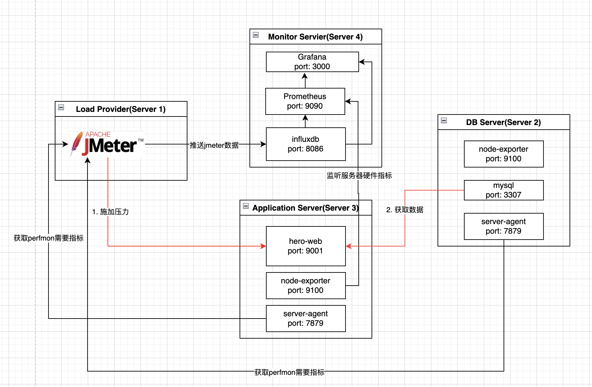
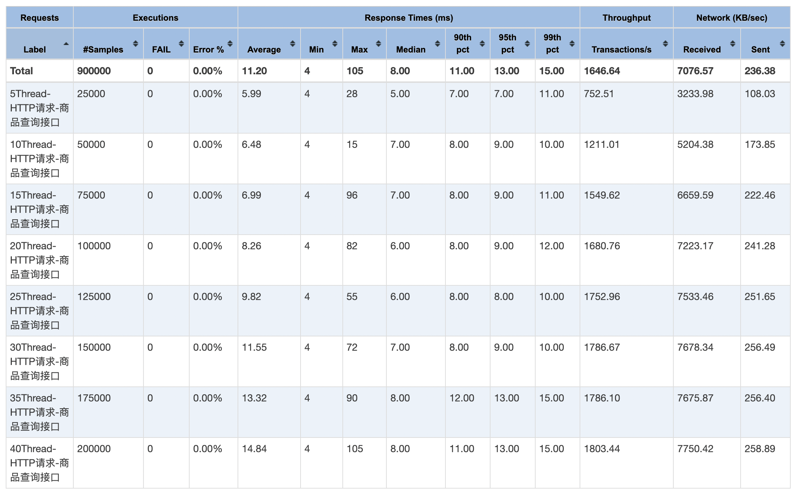
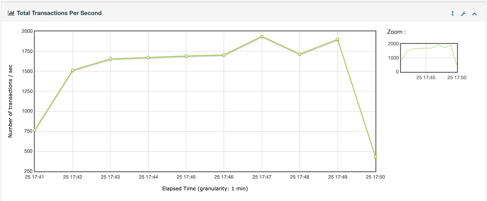
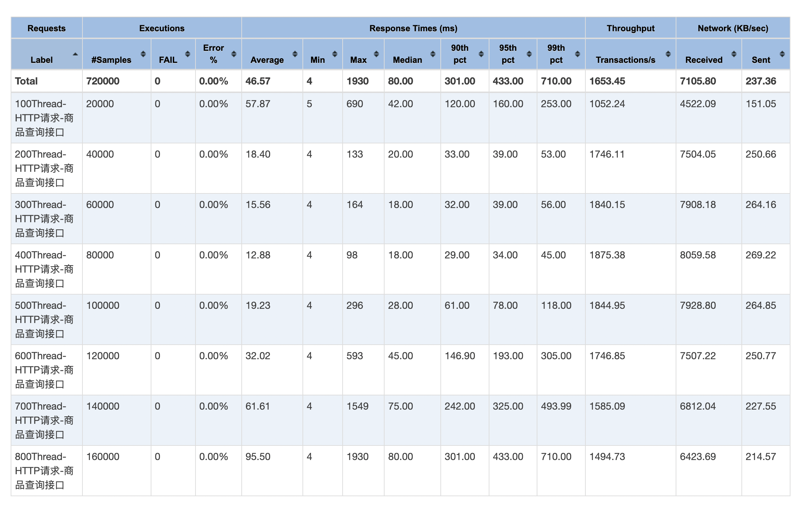
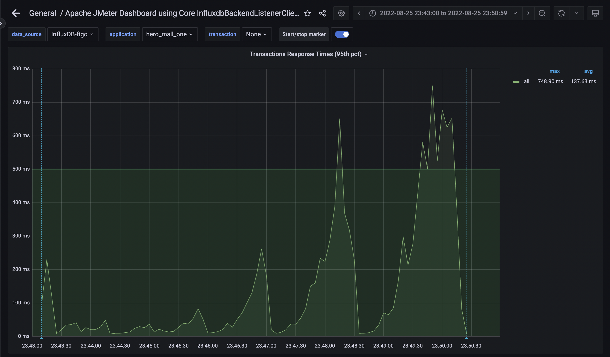
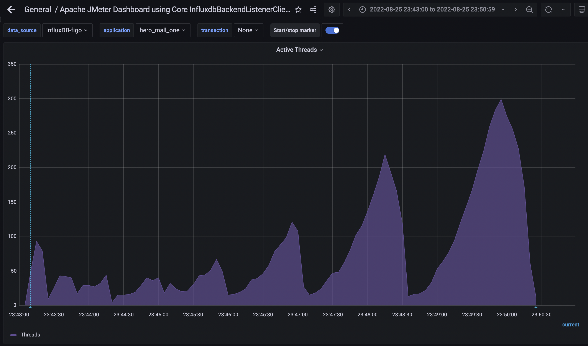
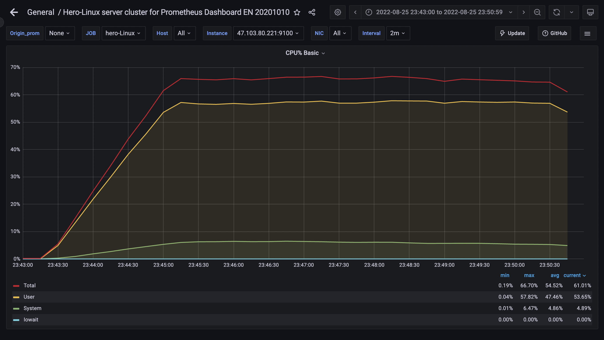
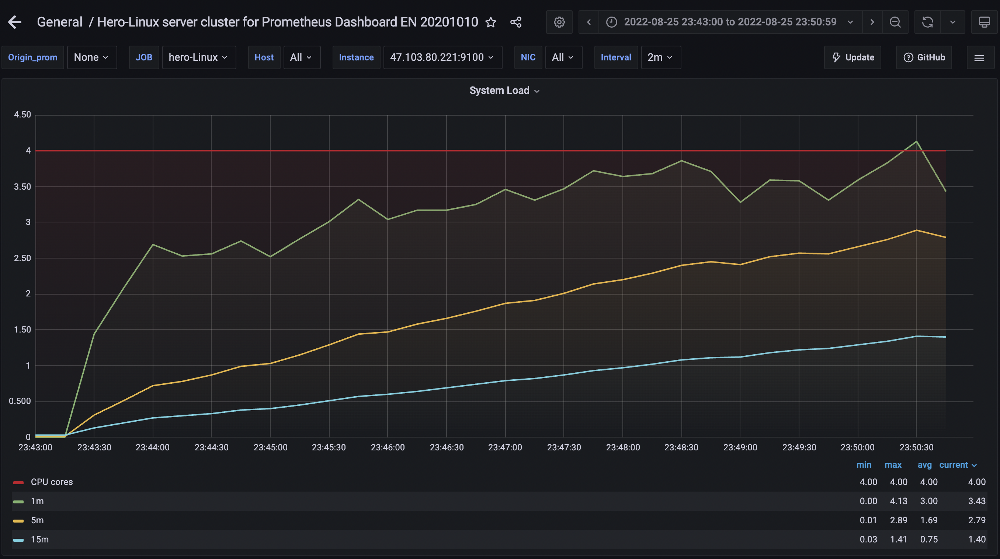
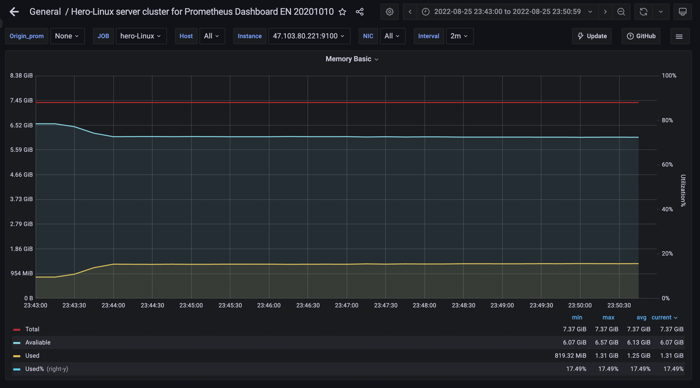

# hero-web压力测试报告

## 01-测试目的
- 通过对hero-web的商品spu查询接口进行压测，找出性能瓶颈
- 通过本次压力测试了解Jmeter的基本用法以及提高分析测试结果找出性能瓶颈的能力

## 02-测试工具

## 03-测试环境
### 3.1 环境
| 指标          | 参数   |
|-------------|------|
| 机器          | 4C8G |
| 集群规模        | 单机   |
| hero_mall版本 | 1.0  |
| 数据库         | 4C8G |

## 04-测试场景
验证hero_mall服务获取商品信息接口在不同并发规模的表现。用户访问接口，并发不断增加的场景。   
**情况01-模拟低并发场景**  

线程梯度：5、10、15、20、25、30、35、40个线程，5000次;
- 时间设置：Ramp-up period(inseconds)的值设为对应线程数
- 测试总时长：约等于20ms x 5000次 x 8 = 800s = 13分  

**情况02-模拟高并发场景**  

线程梯度：100、200、300、400、500、600、700、800个线程，200次;
- 时间设置：Ramp-up period(inseconds)的值设为对应线程数1/10
- 测试总时长：约等于500ms x 200次 x 8 = 800s = 13分

## 05-测试目标
1. 目标峰值TPS: >= 10000
2. P99响应时间：<= 300 ms

## 06-测试结果  

**情况01-模拟低并发场景**

整体看来，系统可以应对低并发场景，最大响应时间均在15ms以内，

但TPS峰值只能达到1900，怀疑和并发程度低有关，因此继续进行**情况02**的测试。

**情况02-模拟高并发场景**  

高并发场景下，可以看到99响应时间从600并发请求后都超过了300ms。
从折线图中可以看得更清楚。

再看此时的并发线程数,发现到了300就不再上升。

观察CPU和系统负载，发现处于较充分利用状态。

服务器可用内存也处于较高水平

## 07-测试结论
应用在并发线程数上受到了限制，不能满足超过300的并发线程。考虑在这里需要进行优化。