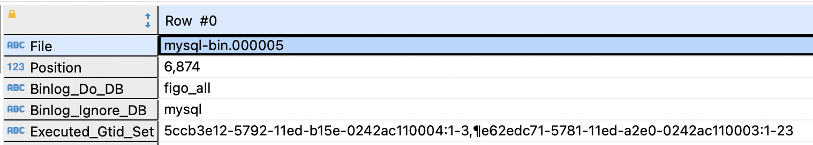
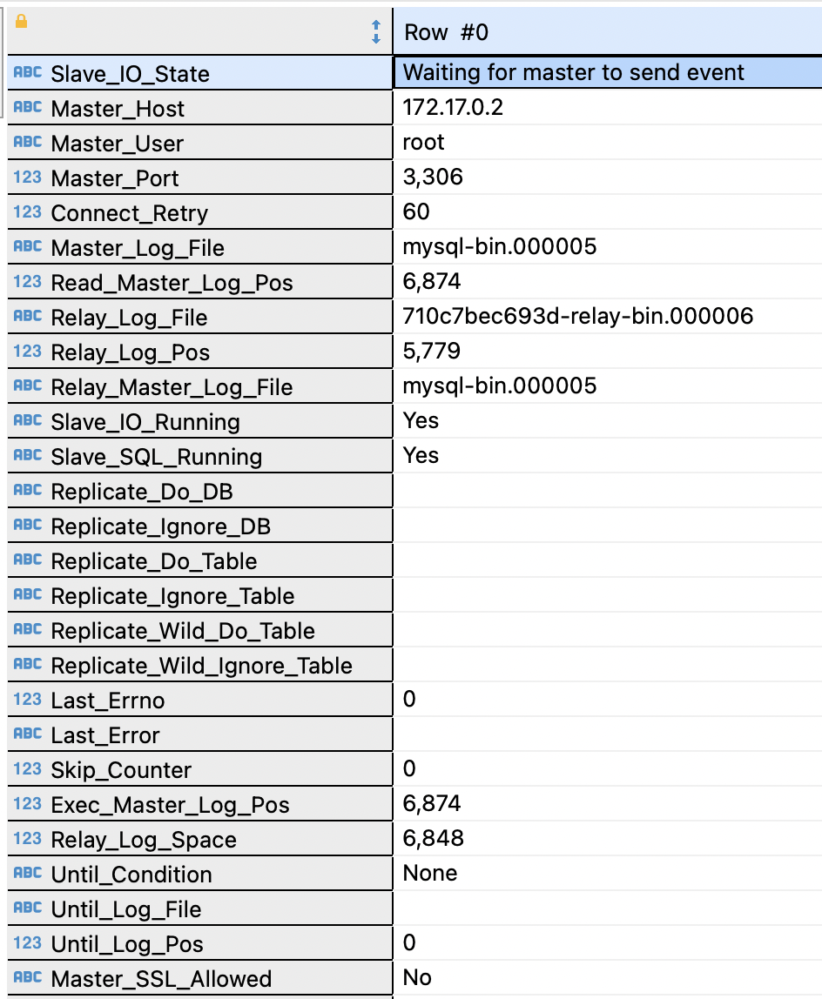

# 题目01-搭建一主三从集群
## 一、环境
* 操作系统：mac os
* 虚拟技术: docker + mysql:5.7 镜像

## 二、搭建主mysql server
1. `mkdir -p /Users/lifei/Documents/T04_tool/docker/mysql2`
2. 
```sh
tee /Users/lifei/Documents/T04_tool/docker/mysql2/conf.d/my-custom.cnf-todel <<- EOF
[mysqld]
max_connections=250
#binlog刷盘策略
sync_binlog=1
#需要备份的数据库
binlog-do-db=figo_all
#不需要备份的数据库
binlog-ignore-db=mysql
#启动二进制文件
log-bin=mysql-bin
#服务器ID
server-id=132
gtid_mode=on
enforce_gtid_consistency=on
binlog_format=row
EOF
```
3. 启动master mysql container  
`docker run --name mysql2 -p 3308:3306 -e MYSQL_ROOT_PASSWORD=figo@2022 -e MYSQL_DATABASE=figo_all -d --volume=/Users/lifei/Documents/T04_tool/docker/mysql2/conf.d:/etc/mysql/conf.d --platform linux/amd64 mysql:5.7`

4. 使用DBeaver用root账户连接mysql2
5. 在DBeaver中打开一个控制台执行
```
grant all privileges on *.* to 'root'@'%' identified by 'figo@2022';
FLUSH PRIVILEGES;
```
6. 查询master的状态
`show master status;`
  
7. 查询主mysql container在容器中的IP，得到master mysql IP为172.17.0.2
```
docker inspect mysql2 | grep -i -m 1 \"ipaddress\"
"IPAddress": "172.17.0.2",
```

## 三、搭建从mysql server
### <a id="SlaveA"></a>A. 搭建从mysql server A ###
1. `mkdir -p /Users/lifei/Documents/T04_tool/docker/mysql3 ` 
2. 执行如下命令
```shell
tee /Users/lifei/Documents/T04_tool/docker/mysql3/my-custom.cnf <<- EOF
[mysqld]
# binlog刷盘策略 
sync_binlog=1
# 需要备份的数据库 
binlog-do-db=figo_all
# 不需要备份的数据库 
binlog-ignore-db=mysql 
# 启动二进制文件 
log-bin=mysql-bin

max_connections=250
# 服务器ID 
server-id=133
innodb_use_native_aio=0

gtid_mode=on
enforce_gtid_consistency=true

#on when cascading repetition
#log_slave_updates=1
EOF
```
3. `docker run --name mysql3 -p 3309:3306 -e MYSQL_ROOT_PASSWORD=figo@2022 -e MYSQL_DATABASE=figo_all -d --volume=/Users/lifei/Documents/T04_tool/docker/mysql3:/etc/mysql/conf.d --platform linux/amd64 mysql:5.7`
4. 用DBeaver登录从mysql server，并执行如下语句
```shell
change master to 
master_host='172.17.0.2', 
master_port=3306, 
master_user='root', 
master_password='figo@2022', 
master_auto_position=1;
```
5. 启动从mysql slave功能
`start slave;`
6. 观察从mysql slave状态 `show slave status;`，可见Slave_IO_Running和Slave_SQL_Running都是yes。  
  

### B\C. 搭建从mysql server B & C  
步骤参考[A. 搭建从mysql server A](#SlaveA)，有一下几点注意事项。  
1. 修改从mysql的编号，比如可以将mysql3替换为mysql4。  
2. 将server-id设置成不同，比如server-id加一。
3. docker run时注意端口号和volume路径都要对应修改
4. 如果在检查slave状态时，发现如下报错
```shell
The slave is connecting using CHANGE MASTER TO MASTER_AUTO_POSITION = 1, but the master has purged binary logs containing GTIDs that the slave requires.'
```
请停止slave后，执行
```shell
change master to
master_host='172.17.0.2',
master_port=3306,
master_user='root',
master_password='figo@2022',
master_log_file='mysql-bin.000005',
master_log_pos=6874,
MASTER_AUTO_POSITION=0;
```
其中的master_log_file和master_log_pos分别和主mysql show master status后看到的File和Position一致。