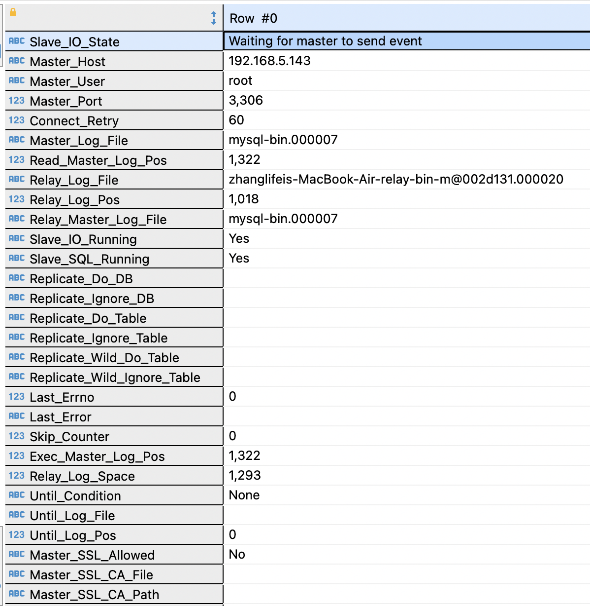

# 一、环境
1. 一台DELL物理机，安装CentOS 7.6操作系统，IP: 192.168.5.143
2. 一台acer物理机，安装CentOS 7.6操作系统，IP: 192.168.5.94
3. 一台Macbook Air物理机，安装MacOS Monterey操作系统, IP: 192.168.5.178

# 二、搭建双主一从集群
## 搭建MySQL主服务
分别在DELL和acer上安装MySQL，安装步骤同雄哥的课堂笔记，但要新增/etc/my.cnf配置文件
1. su - root
2. cd /etc
2. vim my.cnf
```shell
# For advice on how to change settings please see
# http://dev.mysql.com/doc/refman/5.7/en/server-configuration-defaults.html

[mysqld]
#
# Remove leading # and set to the amount of RAM for the most important data
# cache in MySQL. Start at 70% of total RAM for dedicated server, else 10%.
# innodb_buffer_pool_size = 128M
#
# Remove leading # to turn on a very important data integrity option: logging
# changes to the binary log between backups.
# log_bin
#
# Remove leading # to set options mainly useful for reporting servers.
# The server defaults are faster for transactions and fast SELECTs.
# Adjust sizes as needed, experiment to find the optimal values.
# join_buffer_size = 128M
# sort_buffer_size = 2M
# read_rnd_buffer_size = 2M
datadir=/var/lib/mysql
socket=/var/lib/mysql/mysql.sock

# Disabling symbolic-links is recommended to prevent assorted security risks
symbolic-links=0

log-error=/var/log/mysqld.log
pid-file=/var/run/mysqld/mysqld.pid

max_connections=250

# binlog flush strategy
sync_binlog=1

# the database to be backed-up
binlog-do-db=figo_all

# the database not to be backed-up
binlog-ignore-db=mysql

# start binary file
log-bin=mysql-bin

# server id
server-id=132

gtid_mode=on

enforce_gtid_consistency=on

binlog_format=row
```
4. 让MySQL开机自启动
```systemctl enable mysqld```

## 安装keepalived
分别在DELL和acer上安装keepalived，安装步骤同雄哥的课堂笔记，关键配置如下
- /etc/keepalived/keepalived.conf
```shell
! Configuration File for keepalived

global_defs {
   notification_email {
     acassen@firewall.loc
     failover@firewall.loc
     sysadmin@firewall.loc
   }
   notification_email_from Alexandre.Cassen@firewall.loc
   smtp_server 192.168.200.1
   smtp_connect_timeout 30
   router_id LVS_DEVEL
   vrrp_skip_check_adv_addr
   vrrp_strict
   vrrp_garp_interval 0
   vrrp_gna_interval 0
}

// a script to check mysql periodically
vrrp_script check_run {
   script "/usr/local/keepalived/check_run.sh"
   interval 3
}

vrrp_instance VI_1 {
    state BACKUP
    interface wlp3s0
    virtual_router_id 51
    priority 100
    advert_int 1
    authentication {
        auth_type PASS
        auth_pass 1111
    }
    virtual_ipaddress {
        192.168.5.100
    }

    track_script {
      check_run
    }
}
```
- /usr/local/keepalived/check_run.sh  
这里注意shell脚本中表示条件的[]内部前后都要有空格，不然会报bash: 0[not found]的错误
```shell
#!/bin/bash
. /root/.bashrc

# check count
count=1

# cyclic checking execution
while true
do
# check whether MySQL can execute SQL instructions, i=0, normal, i=1, abnormal
mysql -uroot -pFigo@2022 -S /var/lib/mysql/mysql.sock -e "select now();" > /dev/null 2>&1
i=$?

# check whether MySQL daemon is normal, j=0, normal, j=1, abnormal
ps aux | grep mysqld | grep -v grep > /dev/null 2>&1
j=$?

# determine
if [ $i = 0 ]&& [ $j = 0 ]
then
# both i & j are 0, which means MySQL functions well, so break the loop
   exit 0
else
   if [ $i = 1 ] && [ $j = 0 ]
   then
   # i=1 & j=0, which means MySQL daemon is good, but SQL cannot be executed.
      exit 0
   else
      if [ $count -gt 5 ]
      then
      # has checked for 5 times, break the loop and stop keepalived
        break
      fi
   # increase retry times and continue the loop
   let count++
   continue
   fi
fi

done

# stop keepalived
systemctl stop keepalived.service
```  

## 搭建MySQL从服务
1. 在Macbook上安装MySQL 5.7 ```brew install mysql@57```
2. cd /etc
3. sudo vim my.cnf
```shell
[mysqld]
# binlog刷盘策略 
sync_binlog=1
# 需要备份的数据库 
binlog-do-db=figo_all
# 不需要备份的数据库 
binlog-ignore-db=mysql 
# 启动二进制文件 
log-bin=mysql-bin

max_connections=250
# 服务器ID 
server-id=133
innodb_use_native_aio=0

gtid_mode=on
enforce_gtid_consistency=true

master_info_repository=table
relay_log_info_repository=table

#on when cascading repetition
#log_slave_updates=1

slave_type_conversions=ALL_NON_LOSSY

slave-skip-errors = 1032
```  
- 增加了**slave_type_conversions=ALL_NON_LOSSY**的配置，是为了解决从节点同步时报column XXX cannot be convert from varchar(32 bytes) to varchar(128 bytes)的奇怪错误。
- 增加了**slave-skip-errors = 1032**的配置，是为了解决从节点同步时报delete record not found的错误

4. brew services restart mysql@5.7
5. 进入mysql
6. 指向DELL主节点
```mysql-sql
change master to
master_host='192.168.5.143',
master_port=3306,
master_user='root',
master_password='Figo@2022',
master_auto_position = 194
FOR CHANNEL 'm-131';
```
7. 指向acer从节点
```mysql-sql
change master to
master_host='192.168.5.94',
master_port=3306,
master_user='root',
master_password='Figo@2022',
master_auto_position = 194
FOR CHANNEL 'm-132';
```

8. 分别启动两个slave
```mysql-sql
start slave for channel 'm-131';
start slave for channel 'm-132';
```

9. 查看同步状态
```mysql-sql
show slave status for channel 'm-131';
```

```mysql-sql
show slave status for channel 'm-132';
```


10. 如果*Slave_SQL_Running*是NO，可以通过把从节点的gtid_purged设为两个主节点的已执行gtid来解决
```mysql-sql
reset master;
set global gtid_purged='1202a536-6263-11ed-9f36-001ec902e66c:1-7,e5e5a349-6262-11ed-95fd-c8ff283d52a1:1-10,e5e5a349-6262-11ed-95fd-c8ff283d52a1:1-10';
```