# Java虚拟机实践题

## 实践步骤
1. 利用第一周在阿里云上搭建的环境进行实践
2. 分别对hero-web设置三个GC场景，如下表所示

| 场景       | 空间安排                                                      | GC策略|
|----------|-----------------------------------------------------------|--------|
| 吞吐量优先    | -Xms256m -Xmx256m -xmn125m -XX:MetaspaceSize=128m -Xss512k | -XX:+UseParallelGC -XX:+UseParallelOldGC |
| 响应时间优先   | 同上                                                        | -XX:+UseParNewGC -XX:+UseConcMarkSweepGC |
| 全功能垃圾收集  | -Xms2048m -Xmx2048m -XX:MetaspaceSize=128m -Xss512k       | -XX:+UseG1GC -XX:MaxGCPauseMillis=100 |
为了看到GC日志，三种场景都需要配置打印GC日志。配置参数如下：
-XX:+PrintGCDetails -XX:+PrintGCTimeStamps -XX:+PrintGCDateStamps -XX:+PrintHeapAtGC 
-Xloggc:${BASE_DIR}/logs/${GC_LOG}
3. 对以上是三种场景分别记录Prometheus上监控到的JVM图表和GCEasy上对gc日志的分析结果。

## 结果分析
### 吞吐量优先
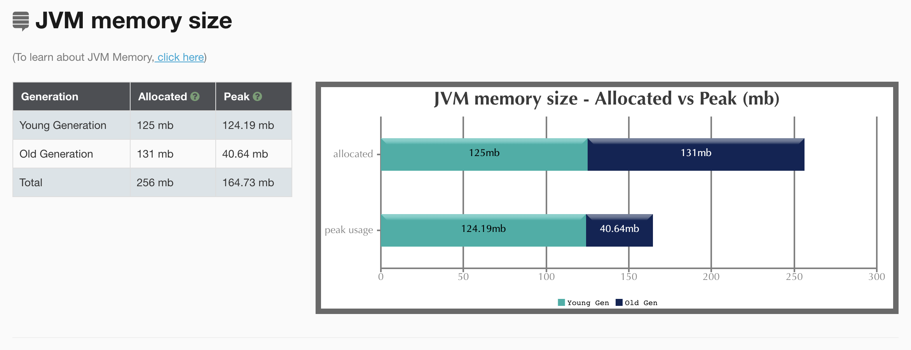
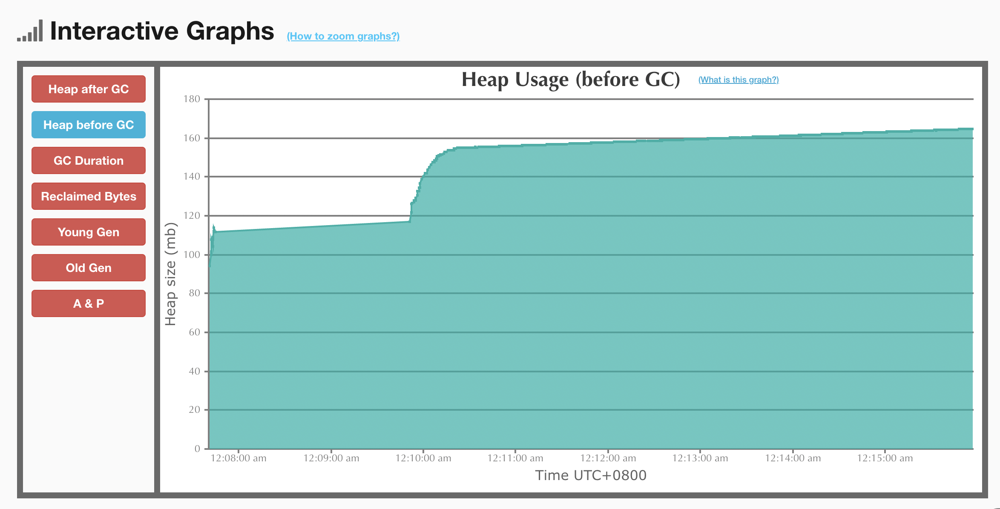
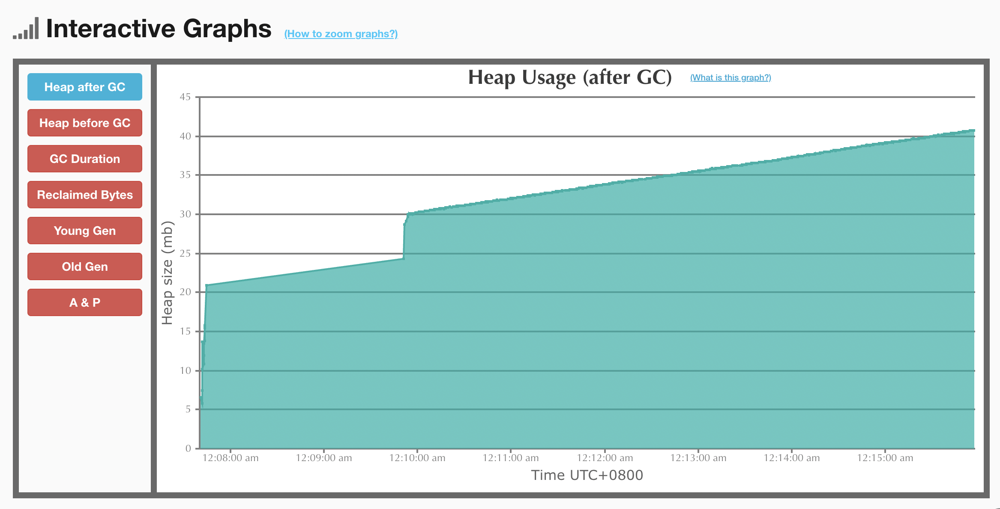
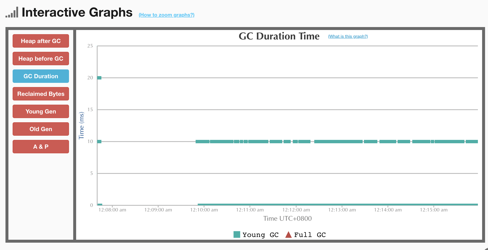
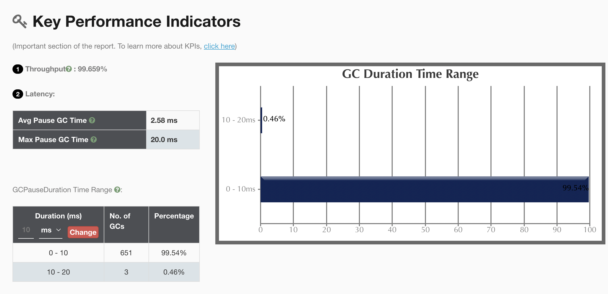
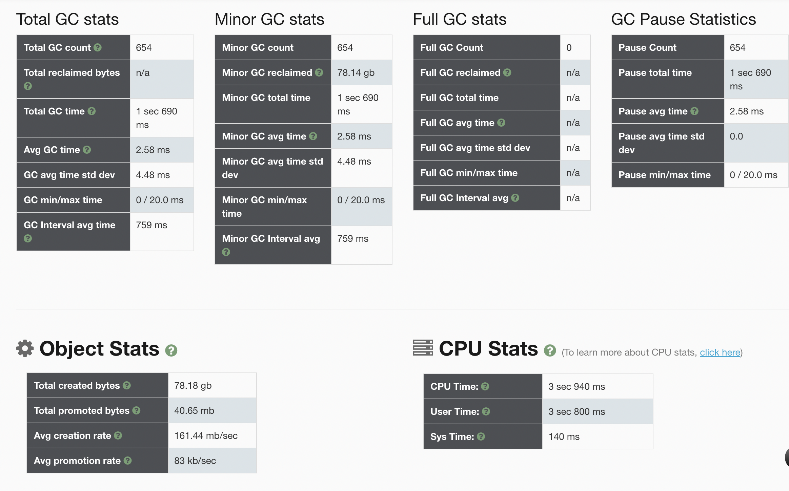
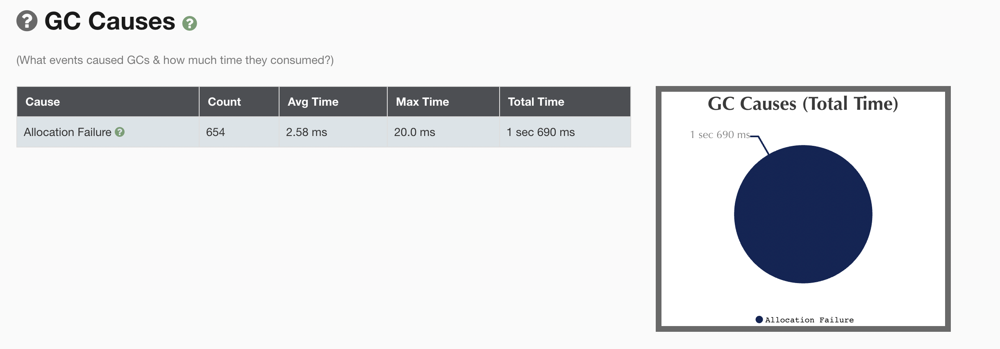

### 响应时间优先

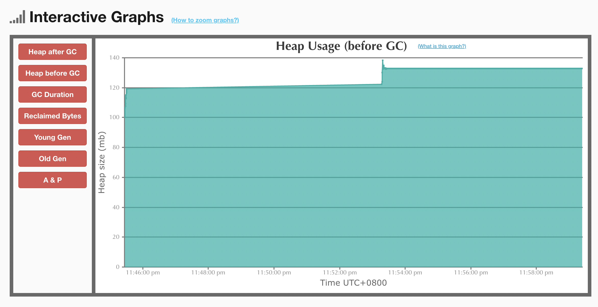
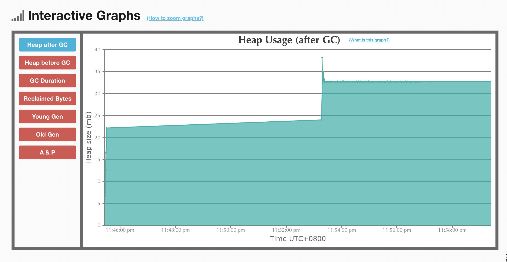
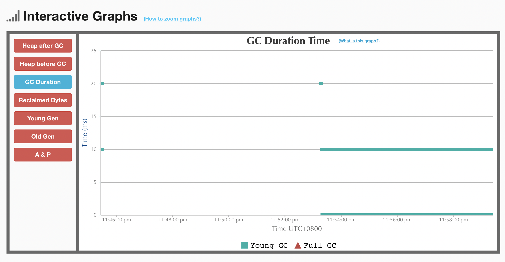
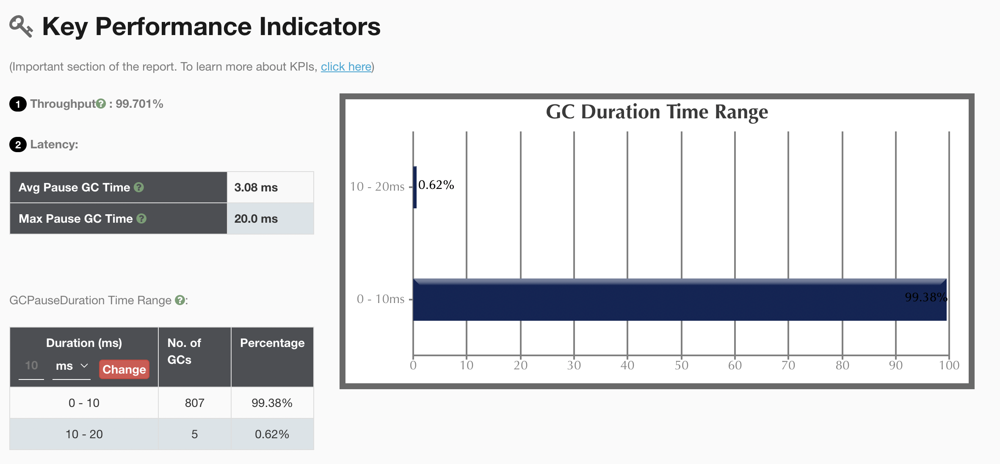
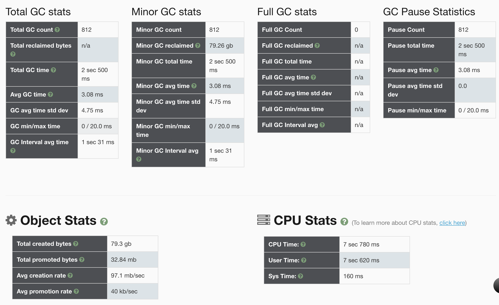
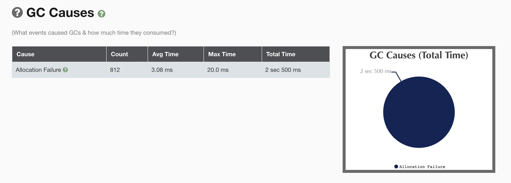

### G1
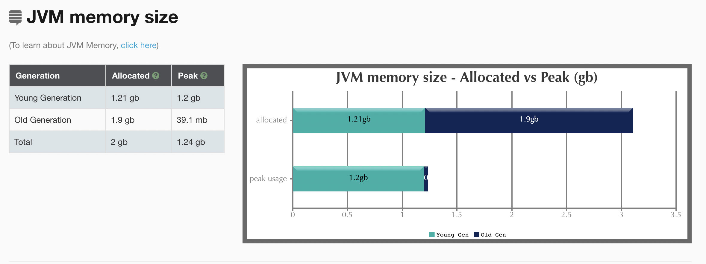
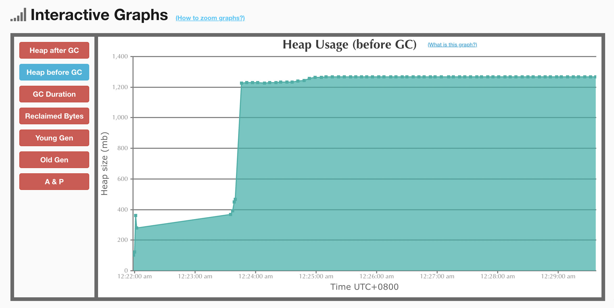
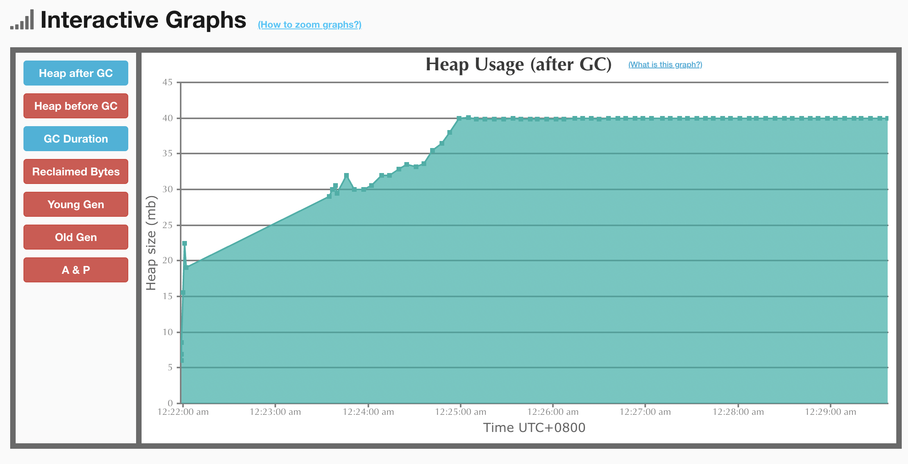
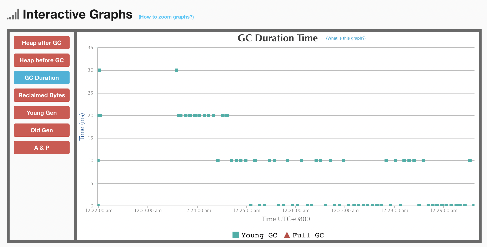
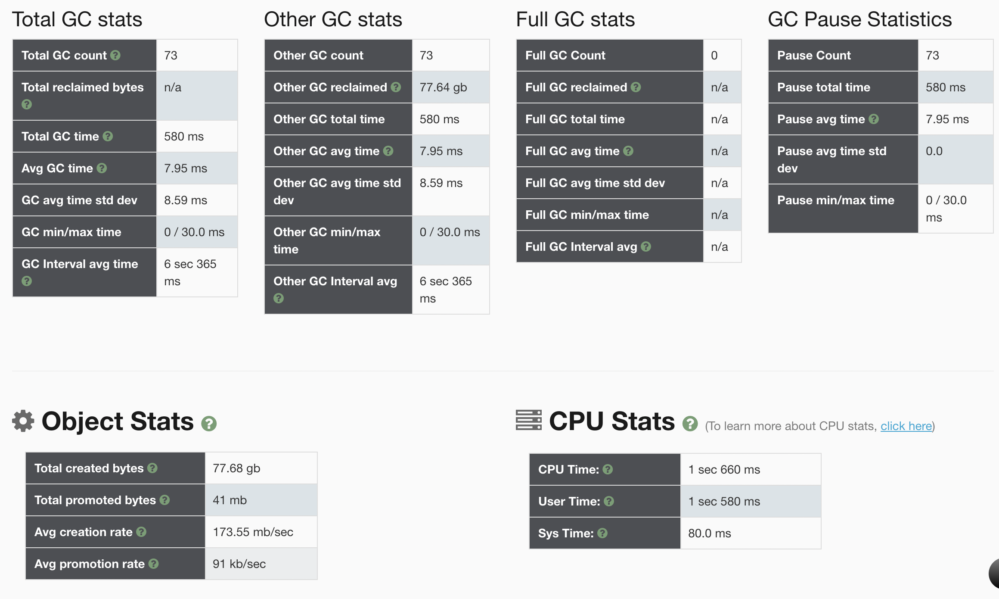
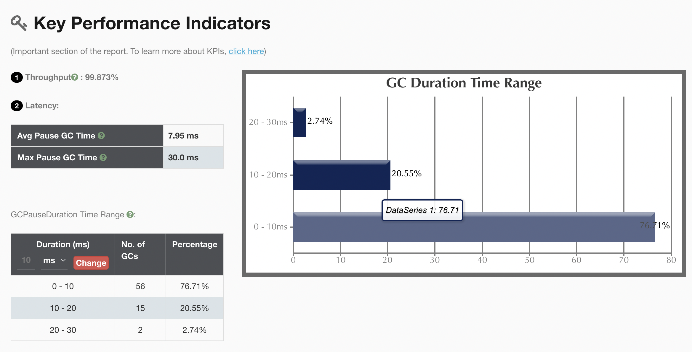
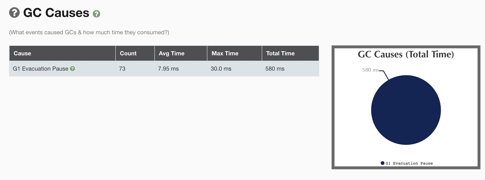

## 结论
JVM运行正常，不需要调优。